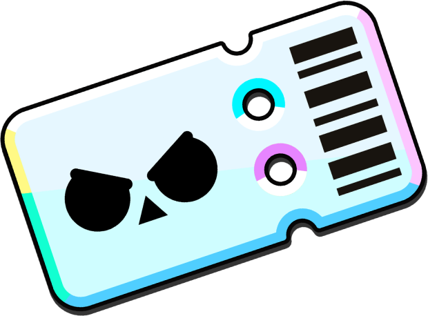

<p align="center">
  
</p>

<h1 align="center">Gracias Supercell</h1>

<p align="center">
  Application React Native / Expo pour consulter et comparer des profils Brawl Stars.
</p>

<p align="center">
  <a href="https://stefanovitch-ilann-24019037.github.io/gracias-supercell/"></a>
  
  
  <a href="LICENSE"></a>
</p>

## Apercu

Gracias Supercell est une application orientee mobile qui permet de:

- se connecter localement avec des comptes de test
- afficher un profil joueur detaille
- comparer deux joueurs en mode versus
- generer et scanner un QR code de tag joueur
- partager un export PNG des statistiques

## Fonctionnalites

- Auth locale basee sur un fichier JSON
- Session restauree en web via `sessionStorage`
- Profil utilisateur avec stats, club, radar chart et QR code
- Comparaison versus entre deux comptes Brawl Stars
- Consultation des brawlers et de leurs images
- Export d'une carte de stats en PNG

## Stack technique

- React Native
- Expo SDK 54
- React 19
- ESLint 9
- JSDoc 4

## Installation

Prerequis:

- Node.js 18+
- npm
- Expo Go ou emulateur Android/iOS

Installation:

```bash
npm install
```

## Lancement rapide

```bash
npm start
```

Reinitialiser le cache Metro:

```bash
npx expo start -c
```

## Scripts utiles

| Script | Description |
|---|---|
| `npm start` | Lance Expo (apres generation des donnees) |
| `npm run android` | Lance l'app sur Android |
| `npm run ios` | Lance l'app sur iOS |
| `npm run web` | Lance la version web |
| `npm run web:clear` | Lance le web avec cache nettoye |
| `npm run lint` | Verifie la qualite de code |
| `npm run build-docs` | Genere la documentation JSDoc dans `docs/` |
| `npm run generate-players` | Regenere la liste des joueurs |
| `npm run sync-players` | Synchronise les donnees joueurs |

## Documentation

- Documentation en ligne: [GitHub Pages JSDoc](https://stefanovitch-ilann-24019037.github.io/gracias-supercell/)
- Documentation locale: [docs/index.html](docs/index.html)

Le deploiement est automatise via [deploy-docs.yml](.github/workflows/deploy-docs.yml).

## Comptes de test

| Email | Mot de passe |
|---|---|
| helali@supercell.com | password123 |
| koliai@supercell.com | password123 |
| stefanovitch@supercell.com | password123 |

## Tags joueurs disponibles

- `#QLVP829R`
- `#VU02GGJQ`
- `#RQPOQOQ`
- `#2PVJU20JQ`
- `#2UVJJPQLGP`

## Flux d'utilisation

1. Ouvrir l'application et se connecter.
2. Consulter son profil et ses statistiques.
3. Scanner ou partager un QR code pour recuperer un tag.
4. Comparer les profils dans l'ecran Versus.
5. Exporter une image PNG du profil si besoin.

## Structure du projet

```text
.
|- App.js
|- src/
|  |- components/
|  |- screens/
|  |- services/
|- data/
|  |- account/
|  |- api/
|- assets/
|  |- brawler/
|  |- favicon/
|- docs/
```

## Donnees locales

- [data/account/users.json](data/account/users.json): comptes utilisateurs
- [data/api](data/api): donnees joueurs et brawlers
- [src/services/playersDataService.js](src/services/playersDataService.js): agregation des donnees
- [src/services/brawlerImages.js](src/services/brawlerImages.js): mapping des images

## Limites connues

- Authentification locale uniquement (pas de backend de production).
- Comptes et mots de passe de demonstration en clair.
- Export PNG dependant de l'appareil ou emulateur.

## Licence

Ce projet est distribue sous licence MIT. Voir [LICENSE](LICENSE).
